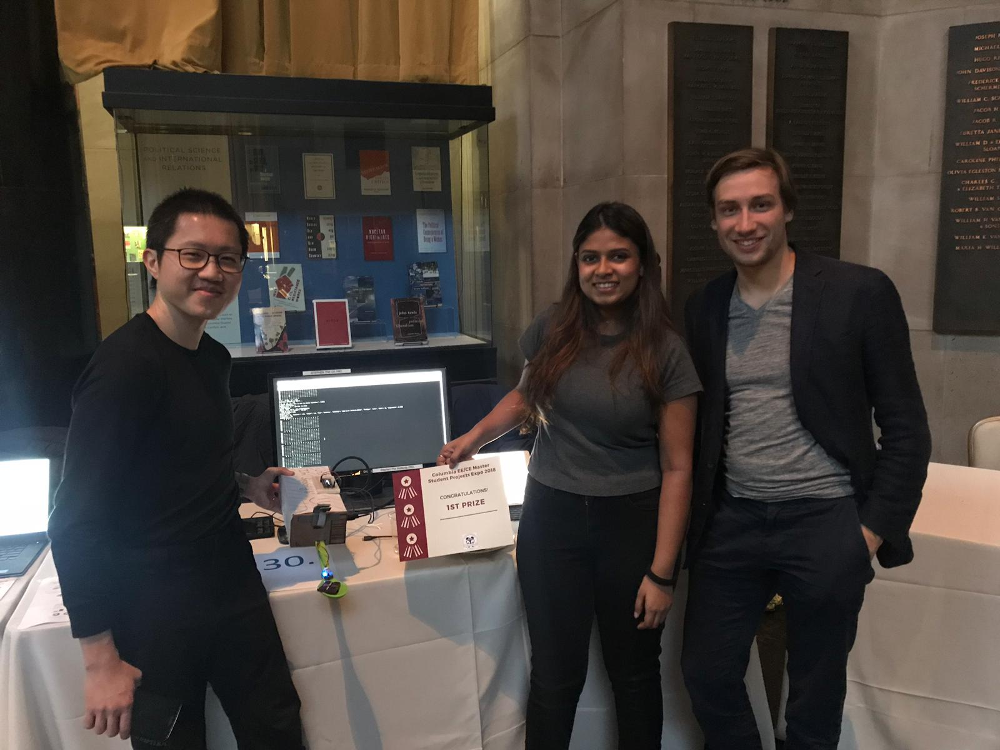

# iot_proj_2018
Columbia University Engineering - IoT Final Project 2018: Spoony, your smart spoon

This repository contains all the code to implement our IoT device:  Spoony, your smart spoon. Contributors are Jan-Felix Schneider, Sing Pou Lee and Tvisha Gangwani.

 

# Brief description of project
Understanding that many people wish to have a healthier diet and track what they are eating but find it inconvenient to do so, we want to build a practical, functional spoon that can do all that for us automatically. 

The implementation of this spoon required the following fields of knowledge:  embedded systems - sensors & actuators, cloud computing for the server, data visualization for the dashboard and data science/deep learning for image recognition.  

Please click on the link below to access our project website and video:
<<to add url>>

# Files organization

